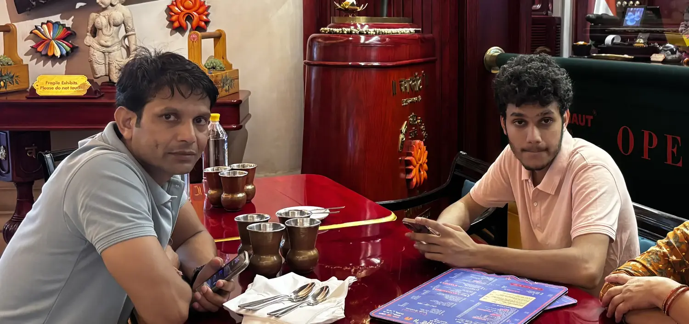

Well I'm going to keep this blog a little shorter but I've been a guy who observes himself a lot more than anyone.

People may call me paranoid but I do tend to do some certain things so that I can stay intact mentally and physically.

I don't eat more than 1 roti in a meal, and if i do there's a high likely chance of me being less energetic.

My father is a great influence over my personality but of course no offspring can be 100% of their parent's personality.

But well some stuff like workaholic nature and working out came from my father because he has done wrestling (till he was 30),
military training and police training.

He's 45 in this picture.

I don't really wanna get every single information out there about my father but well I started running because of him.

Did combination of burpees and everything.

As a programmer we want to spend a lot of our time just programming and building things right but again for some being healthy
means having type 1 muscles but you can always be healthy and focus on type 2 muscles as well.

My Routine for Working out is mainly just 2-4km running at 4:40 - 5:30 Pace, burpees with push ups, pull ups and chin ups.

So why not gym? Whenever we are breaking our muscles down we need a lot of rest to repair them and brain energy to reach that endpoint.

So your body focuses more on your muscles and maintaining good glucose levels and meanwhile on the other hand you're likely to sleep more.
Okay this is a personal choice but if you want to work 15 Hours a day just sleep 7-8 hours, run for 15 minutes and drink liquid a lot because
it's easier for our body to digest and ingest. But don't consume stuff with sugar and specifically not artificial sugars.

For me electrolytes, milk, some carbs, oats, quinoa and fruits matter the most in my diet. BTW EAT WATERMELON IN EVERY MEAL IF POSSIBLE IT'S GOOD FOR YOUR LIVER.

Either way this is all personal choice but if you're planning to ditch coffee and find an alternative. PLEASE DRINK WATER + LEMON.

So A Good Combination of Everything like inclusion of sun exposure is nice (sunscreen is bad for your vitamin d production).
I've tried sunscreen once but my perspective finds sunscreen useless.

Combination of Vitamin D + Electrolytes + Good Food with Nice Vitamins + Healthy Liver (don't consume artificial flavours and sugar)
If you're missing out on anything you're very likely to go through a burn out (yes I mean there are other factors as well) or depression as well.

Please read [Reflecting on my Mental Health & Burn Outs](http://localhost:4321/posts/mental-health-burn-outs)

You're supposed to consume food which makes you feel energetic and if you feel tired after eating something, just ditch that.

Most likely it's a glucose overload or something which is not being digested properly. ALSO IF YOU EVER GET A GLUCOSE SPIKE JUST HAVE PROTEIN IN ANY WAY
OR FORM EGGS ARE THE BEST THOUGH IF ANY OF YOUR FRIENDS HAVE DIABETES THEY CAN HAVE EGGS DAILY AS THEY ARE GOOD FOR THEM.

I used to get pimples whenever I did a cheat meal maybe something with sugar or something with artificial flavours.

My dad uses an isolate whey protein without any flavours because that's the best thing possible.

He's been gyming for 15 years and I would say you don't require gym if you can do cardio and push ups.(He's limited to running less than a kilometer because his knee still hurts from surgery he had after a skiing accident.)

That's enough for you as a programmer but if you wanna get big and jacked well drop programming bro.

Staying healthy is easier if you don't overeat. Be a Yogi.

Fitness is not about having muscles, it's about making your blood and brain healthy.

Your body is a vessel and if you eat bad you're just ruining the thinking process all together, one of the reasons why people who suffer from financial
issues are very likely to take bad decisions because it comes from the place of bad nutrition and workout which in short makes the person a bit mentally unstable.

Being active and taking care of ourselves is basically just confidence booster which later equates to being mentally strong.

If you wanna have a talk with me feel free to drop me a mail at meow@nermalcat69.dev or my twitter.

Also i may edit it better the next time