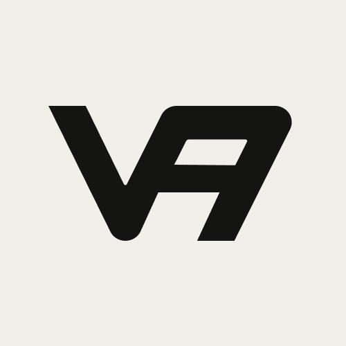

#### Coldran

Stealth & Personal Project.

#### Valixio

[Valixio](https://valixio.com) helps B2B Businesses Scale Sales with Custom AI Systems.
This Logo was designed for free for my friendo [Vaishnavi Singh](https://x.com/vaishchhu24).
