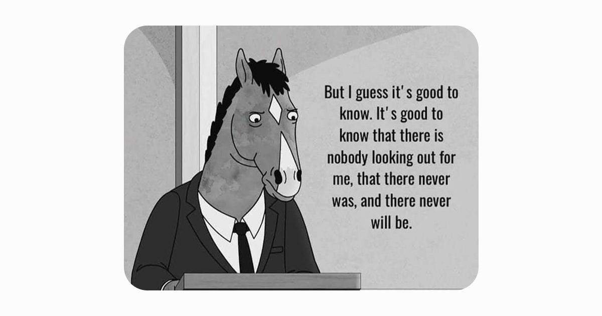
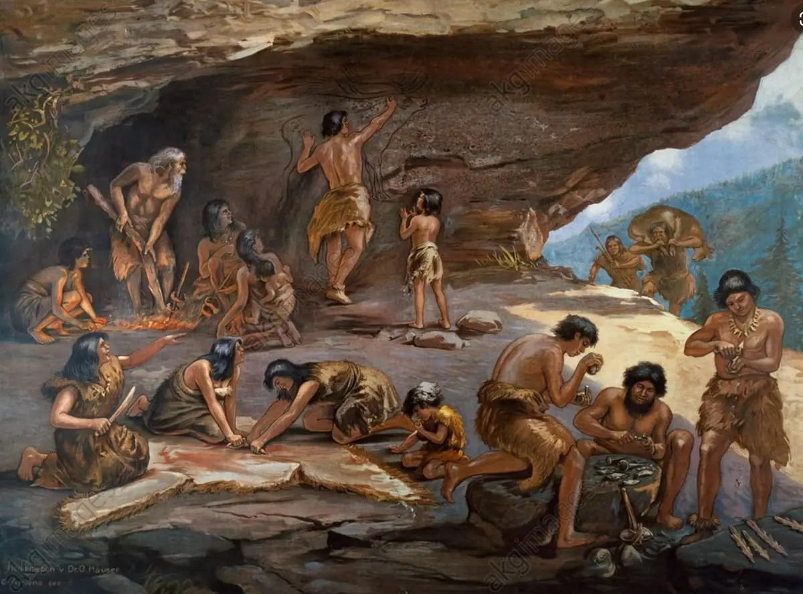
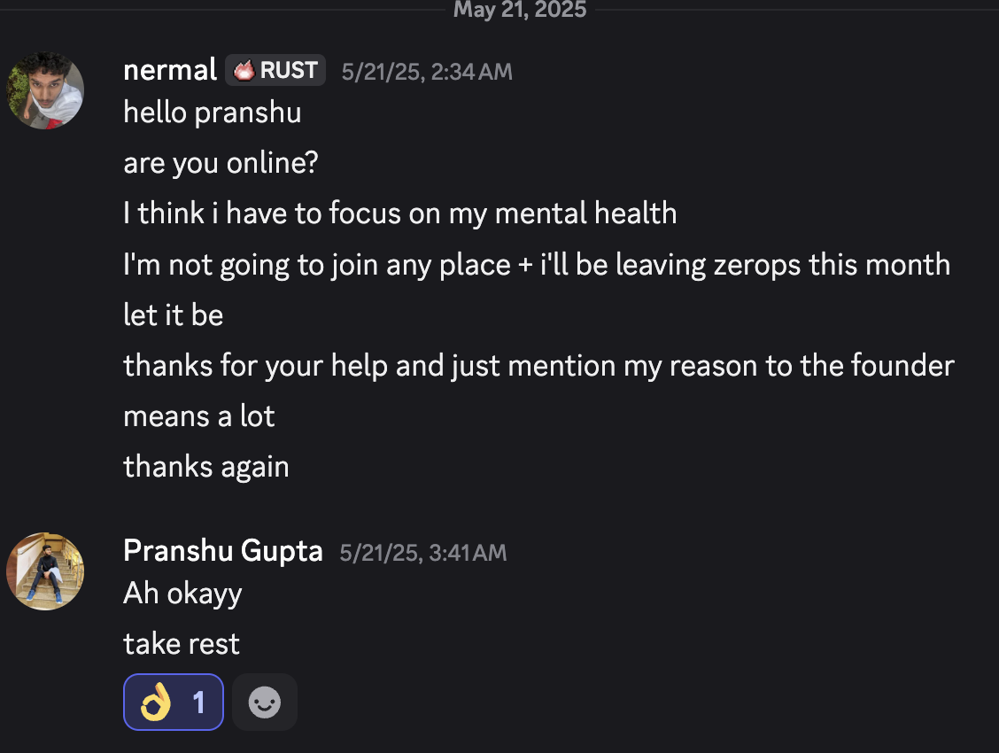
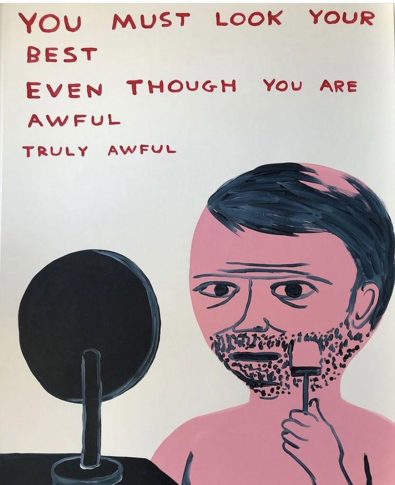

import { Tweet } from "@astro-community/astro-embed-twitter";
import SvgZoom from "../../../components/SvgZoom"

Whenever a person goes into some mental distress, it's mainly because of
missing out on some important things in life.

As per evolutionary biology, Humans are meant to fulfill some criterias
to be a part of this society because to be social and validated
to some extent for their efforts and contributions is needed to keep them
sane and increase their chances of survival.

Also equated to them feeling good about themselves + self love became a thing
for them.

Humans with good standing and pedestal were considered worthy in the eyes of
others and got all the attention and love from the society.

They got all the things a person desires in life, requited love, validation,
respect, money, power, etc.

Any Sane Human will share interests with others and they're very likely to
be mentally stable but if they don't, They're very likely to go through a bit
rough time but as interestingly as it sounds, Internet made it pretty easy to
find similar interests like sharing the love for cute anime girls for that stuff
we have reddit and 4chan.

Point being validation is the biggest need in life, *just my personal opinion*

But we can always refer everything to Maslow's Hierarchy of Needs for that.

People be like "humans used to panic when they had to run from a tiger,
now they panic when someone leaves them on seen. we failed as species"

I would like to mention that this is not called failing, we as humans
are very much similar to our ancestors but our means and criterias just
pivoted a lil bit.

We've inherited almost everything from having the love for some specific
food to having a type of person we're attracted to.

Btw, Just a random theory that if you're attracted to a person, It's also
because that person is a replacement of your parent. For example, if you're
a guy attracted to a girl, It's because that girl is a replacement of your
mother and vice versa.

I think this theory was mentioned by Sigmund Freud afaik.

But according to societal standards, nobody thinks about having sex with their
opposite sex parent, *referring to the Oedipus and Electra complexes*

I wrote a quote some months back,
> "Humans are clueless and they think outrageous stuff and conclude it for no fricking reason,
> Everything is Symbolic" - [my archived ranting insta during my worst mental health
state](https://www.instagram.com/arjunexpressed).

-----

Well let's just talk about how does anyone get to the top of the pedestal?

By going delusional, if they don't have resources, they'll just manipulate their
brain into taking crazy risks.

Mental state plays the biggest part in societal success because our brains are
wired in a way to make decisions as per survival instincts.

Insensitive people are very likely to take very rational decisions and emotionally
unstable people tend to ruin everything and that's the only bar which stops them to
reach the top.

A person who comes from a good economic background has a very high chance to generate
exponential amount of wealth because how for them they are pretty confident and
being confident about something.

Delusion kept people above the average pedestal because they always maintained
themselves optimistic and others were stuck in flight or fight mode.

Being delusional is a privilege considering your background and life choices
some don't like taking the risk and some don't like taking the responsibility.

------

### Impressing People

I'm still very much into impressing people but I think you can never impress everybody,
you can't look cool or valuable to everyone because their experiences and situations made
them to judge and opt in for survival mode for certain type of person.

I used to help people for free because it made me feel more worthy & validated and somewhere
in my mind i was a bit selfish about one thing that if i'm helping this person out, I'll probably
get something in return maybe emotionally or financially. 

But well people like me get exploited in this thing and wouldn't really recommend this because
it involves a lot of luck and if you're not a lucky one you've successfully wasted a lot of your time.

But again you'll never be able to impress every single human being by doing something for them.

The way there's a stereotype about how a Haryanvi men fears Punjabi women and how Himachali
Women love Punjabi men.

And changing that societal stereotype takes time, if your identity is hated by someone it's
very rare for you to get validated by them.

Some VCs heavily go after white founders, some go after Indian founders, some go after stanford
dropouts and some go after people with neurodivergent backgrounds.

Because that's their preference and they are not wrong, they are just doing what they think is right.

Just a person trying to feel safe because their survival instincts prefer that.

I've always seeked validation from people I've looked upto and not being upto the mark in their eyes
made me question my whole skill and capability.

### Failing at my first mvp (17yo) *2023 Dec - Jan 2024*

I was starting a startup called Codestake with two friends I met on discord,
[Viraj Shah](https://www.linkedin.com/in/viraj-shah15/) and [Priti Roy](https://x.com/DevPriti1).

The idea of codestake was basically mix of Hackathons, Algora & Superteam Earn(was suggested by amy), A place
where a developer can make money either by serving bounties or by competing in hackathons.

But as usual it was my first time working on an idea with people and them having expectations from me.

I got overwhelmed and ended up ruining everything we had after a month because i was not able to fix
an error and I was very insecure of asking for help but well after some time I compensated them with
some money because I felt that they deserved it atleast for even giving a bit of their time.

Going all in is nice but not staying chill pushes you into the burn out zone, I remember priti told me how
playing games helped her mental health and burn outs *basically i ended up playing minecraft because macos :/*

Then later had to move on from Codestake.

*A month later - basically february 2024*

Posted some stuff on a subreddit and met [LinearArray](https://www.reddit.com/user/LinearArray/)
and then later moderators of very pretty big indian subreddits. Also met [Namish](https://namishh.me)
and no he was not a moderator.

Never applied to jobs as i suffer from severe imposter syndrome *i still do as of july 22,2025*

Well either way as i had some design & creative skills i ended up improving a big discord server
and then later became an admin in just 11 days(basically i had the access to ban 4k members at once).

Then later had a pretty big drama on the subreddit and got hate comments by atleast 1k people but well
we move on again.

All these reddit incidents happened in Jan - March 2024 Time Frame

I don't really like being stuck at one place so i just ditch and go for the bigger quest
*love the word quest*. Moving on from things and pivoting is pretty doable for me as i was
never really biased to just my thoughts, i don't mind change.

I was in [Sri Budda](https://www.linkedin.com/in/sri-budda/)'s discord server, Where I saw the ceo of [zerops](https://zerops.io)
lurking and I ended up joining his server where i asked if they're looking for a frontend developer in the channel then later
he dm'd me about how they need a dev rel type of guy. I contributed a bit to zerops from april -> july for no compensation
then later Ales(the founder) got notified that it's my 18th birthday on 9th of july.

He asked me if i would work at zerops then obviously it was a yes and he hired me with an intern role as they were low on funds
and couldn't hire me as full time because they'll have to pay me more as per czechian laws.

Helped [Zerops](https://zerops.io) with mainly user experience stuff and dev rel stuff. I really loved working there for the next 8-9
months then well ofcourse people get bored and me being me, a person who requires attention and validation. The team was not young
considering most of them were above 28 as far as i know + some of them were just working with esops without any pay + had another jobs.

> In November, I reached out to a friend at Notion if i could work at notion as an intern but well the relocation issue f'd up the whole plan.

Which obviously made them pretty busy so giving me validation and attention to me was not their preference and i tend to go through
a weird seasonal depression phase from january to march (in here we are currently talking about 2025 january time frame)

Plus, I was seeking for extra income source + autonomy + validation, So well i tried and worked. Shipped a vs code extension in the end
and then left Zerops.

Let's just keep the zerops part aside

> Also to get customers on zerops, I used to sell ai wrappers on [flippa](https://flippa.com) for like $170 - $250 and then later get their website hosted on zerops.

I was sucha validation wh*re that i somehow got the chance to improve sahil lavingia's personal website but my first intial PRs were rejected as they were pretty heavy + not very concise *[january 2025]*.

-----

During january - march 2025 time frame, I used to go for runs everyday and walked at 11 am topless with my dad in an empty park
*no i'm not insecure about my body but well i have abs + i had good amount of weight at that time*.

Point to be noted as per me a person requires physical activeness when he feels worthless and when you're losing apetite you need
to workout so that you get the blood flowing everywhere.

It helped me a bit and i forced myself to work everyday so that the zerops people don't find me a burden and for that part i didn't opt for the february compensation.

<SvgZoom
  src="./mental-health-composition.svg"
  alt="Zoomable SVG"
  maxZoom={2}
  containerHeight={400}
  client:visible
/>

Plus, I am never going to refer anyone to my workplace because i referred a guy to zerops in november and he didn't do shit and at the end ~
It turned out to be pretty embarassing for me even though the founder didn't really blame me.

So that was a bit of L on my behalf because he got in without any interview because i asked the founder to hire him.

either way let's keep all this aside 

It was may 2025, I was thinking of leaving zerops but somehow a guy named divit rana reached out to me that they are hiring a guy at radical health but i was like i'm not the
right person to hire but he still insisted me to take the interview and this story went a bit too crazy.

Also i was friends with one of their employees and he mentioned it's basically a services startup and it's fine you'll get in easily.

But i wanted to try this interview for fun

I get on the interview(no it was not technical, the ceo commited bad code using cursor) but we talked and he asked me some very personal questions + as i was at my lowest
and some of his questions go like:

- Him: What are you proud of?
- Me: Nothing to be honest, I've not done anything which makes me feel proud

- Him: How was your childhood
- Me: explaining how i didn't have friends and stuff 

- Him: Were you understood by your teachers and parents
- Me: I don't think so

*ps: divit guy was in the call as well but the founder was interviewing me*

The biggest problem was i was not even looking for a job and not even interested because i was so fookin' drained. But the founder did make me hate the whole bengali community.

I would still say my personality is very complex because i can't comprehend and explain myself sometimes and the founder of radical health also mentioned how he can't comprehend
my personality. One of the lines i repeated infront of him was "I'm the not the prententious one or someone who's fake".

Well either way we later talked about tea leaves and their competitors because selling tea leaves is my side plan if tech industry pushes me out.

I felt a bit bad that i've successfully self sabotaged myself by fuking up this job which could've paid me 32LPA. BUT I WAS FREE

The point being, I was not good at selling myself nor was it my intention *i'm trying to get better at it now*. fun fact: I still don't have a resume pdf.

BTW I WAS REJECTED BY THE FOUNDER BECAUSE HE DIDN'T LIKE MY PERSONALITY HEHEHEH

AND LATER I MILKED THE WHOLE SITUATION AHHAHAHAH

<Tweet id="https://x.com/ArjunShips/status/1918570256945299845" />

<blockquote class="reddit-embed-bq" style="height:500px" data-embed-height="593">
    <a href="https://www.reddit.com/r/Btechtards/comments/1kdu4oh/used_this_background_in_an_interview_g_meet/">Used this background in an Interview (G Meet)</a>

    by <a href="https://www.reddit.com/user/WeirdKiddo73/">u/WeirdKiddo73</a> in <a href="https://www.reddit.com/r/Btechtards/">r/Btechtards</a>
</blockquote>

------

But i've realized one thing in my life that if i'm not desperate for something too badly or i ditch a job, i'll get a way better opportunities
if i'm working hard.

After A Week, I was talking to [Pranshu Gupta](https://x.com/pranshgupta54) and I was like i'm leaving zerops and yada yada yada. He was like why not work at my workplace
I was like hmmm i'm not sure i'm capable of that *imposter syndrome triggered*. 

I WAS NOT READY TO FACE ANOTHER REJECTION AGAINNN but well he was like we don't really waste
time on interviews that much just an onboarding call but then well i was very scared to face the founder.

Well the founder of the company where pranshu works scheduled the meet and then after contemplating for hours.

I ended up texting pranshu saying smthg like

Pranshu also told me how he reffered a person who didn't do shit and he got fired *he's pretty famous on indian tpot btw*

That guy was busy with hackathons LOL.

------

### So What's actually wrong with me???

- No Creative Outlet
- Autonomy of Product
- Validation
- Pointless Work in my Eyes
- No Public Audience to Cater
- Financial Needs
- Getting Attached to People / Companies
- Going all in even though it's not compensating me enough
- Not playing games
- Having Less Funsies

PLUS I LOVE TALKING AND EXPRESSING MY THOUGHTS WHEN I'M NOT DEPRESSED -~~ *THAT RADICAL HEALTH'S FOUNDER ALMOST MADE ME CRI WHEN I WAS QUESTIONED ABOUT MY CHILDHOOD SO YEA*

I'm good with keeping my body healthy though so not sad about that part as most programmers suffer from issues because MOST OF THEM ARE SUCH DUMBASSES WITH NO SENSES

<SvgZoom
  src="./insanity-on-a3.webp"
  alt="Zoomable SVG"
  maxZoom={2}
  containerHeight={500}
  client:visible
/>

Made this while being on a call with a judgemental acquaintance in march.

Being responsible is pretty much the hardest part and i've tried my best whenever i worked with someone but now i ditch
people right away whenever i feel like they are not good for me.

Some People fold and some just keep on going. SO FOR NOW I'M BUILDING MY OWN THINGS BUT IF I EVER GET A CHANCE TO WORK SOMEWHERE I'D LOVE TO WORK FOR A TECH + MARKETING ROLE.

I'VE BEEN EXPLOITED BUT NOT ANYMORE - ALSO I HATE IITians and people who question someone's capabilities.

I would say one thing though, you can never know if someone properly in an interview you'll need to spend atleast 2-3 days and see their work culture to actually understand and comprehend their brain process.

### Wrap Up / Observations / Introspection

So hmmm the wrap up, personally what i think about this whole thing happened and how i've questioned everything and ditched interviews *recently ditched my interview* with [aiden bai](https://aiden.mov)'s [same.dev company](https://same.dev).

I'll try to figure out how to get over it but personally i'll try to just build more of my things and cater more to people and get some public validation and help people with growth and marketing.

If you want to talk to me you can just drop me a dm on my [instagram](https://instagram.com/nermalcat69), [twitter](https://x.com/arjunships) or @nermalcat69 on discord.

I have some movies which changed my life

- [Vikings](https://www.netflix.com/in/title/70301870) - American/European Show
- [Three of Us](https://www.netflix.com/in/title/81730353) - Indian Show
- [Into The Wild](https://www.primevideo.com/detail/0KEKSSJPFKMT43ZDZ6WWNFMCYK/ref=atv_dp_share_cu_r) - American Movie
- [Atypical](https://www.netflix.com/in/title/80117540) - American Show
- [Hillbilly Elegy](https://www.netflix.com/in/title/81071970) - American Movie
- [Anand](https://www.youtube.com/watch?v=vdoMF0qwtAQ) - Indian Movie
- [Bawarchi](https://youtu.be/mkUGA1Eeh9c?si=lVxgbau-BONt7oVv&t=2) - Indian Movie
- [The Pursuit of Happyness](https://www.netflix.com/in/title/70044605) - American Movie
- [Life of Pi](https://en.wikipedia.org/wiki/Life_of_Pi_(film)) - American Movie
- [Rocky](https://en.wikipedia.org/wiki/Rocky) - Canadian Movie
- [Dead Poets Society](https://en.wikipedia.org/wiki/Dead_Poets_Society) - American Movie
- [Fight Club](https://en.wikipedia.org/wiki/Fight_Club) - American Movie
- [Sacred Games](https://www.netflix.com/in/title/80115328) - Indian Show
- [Anwar Ka Ajab Kissa](https://www.youtube.com/watch?v=eHgmQ51wWkI&t=5447s&pp=ygUTYW53YXIga2EgYWphYiBraXNzYQ%3D%3D) - Indian Movie
- [Bhaag Milkha Bhaag](https://www.youtube.com/watch?v=7oEHU51BzkA) - Indian Movie
- [Lakshya](https://www.primevideo.com/detail/0QX1A99V40EGILD1J4VMOTQ2VI/ref=atv_dp_share_cu_r) - Indian Movie
- [Udaan](https://en.wikipedia.org/wiki/Udaan_(2010_film)) - Indian Movie
- [Wake Up Sid](https://en.wikipedia.org/wiki/Wake_Up_Sid) - Indian Movie
- [The Namesake](https://en.wikipedia.org/wiki/The_Namesake_(film)) - Indian Movie

ps: i don't pass my blogs through llms because i don't want my essence to vanish. So you'll see grammar mistakes as english is my second language(personally i'm equally bad at every language possible).
