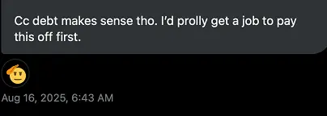
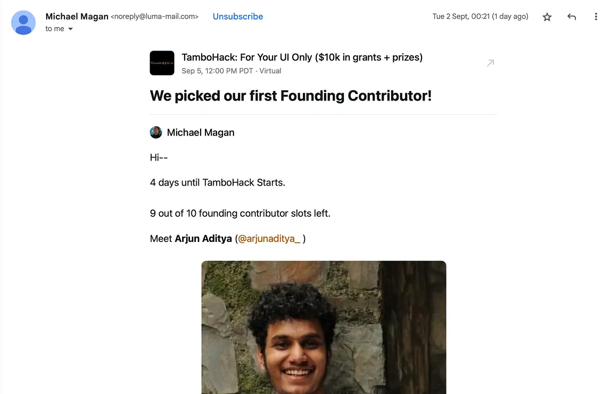

import { Tweet } from "@astro-community/astro-embed-twitter";

  

  
*this image was taken in a remote village near kandaghat

I use "Side Questing" term for building projects separate from the main project,
providing marketing and funds which is essential for completing the primary main project.

Specifically for Bootstrapping.

Currently, I'm facing some financial issues and I have some side projects which i can make alive
to make $1K MRR within 2 weeks + That will give me funds to run Coldran and that will also get me
out of credit card debt.

And Yes, I've reached out to VCs. Some of them just rejected and one said get a job.

Yes I've got job offers but all of them wanted me to sign a long contract.

Coldran's a product which will take me 2-3 months to even reach $500 per month because the customers
i have on the line don't have enough money to pay + it will take me more iterations to even reach
$1-2k per month which may take 5 months.

But as I need $1k within 40 days.

For that, I’m also participating in [TamboHack](https://luma.com/e5irqmfh) by [Tambo](https://tambo.co). The results will be announced
on September 12. I’m writing this blog on September 3, and I’ve been elected as the first
founding contributor.

I'll be working on three products, and their customer base will most likely find
Coldran valuable and may even turn into customers themselves.

Why am I doing this?
- Rejected by YC, Solo Club and some other grants from merge club.
- Sahil Lavingia's Book influenced me into this.
- Rejected by an Independent VC.
- Left on seen by others

For Now, I'll be bootstrapping and building side quest products which will keep me stable
so that I don't have to get a full time job.

Thanks for reading this journal.