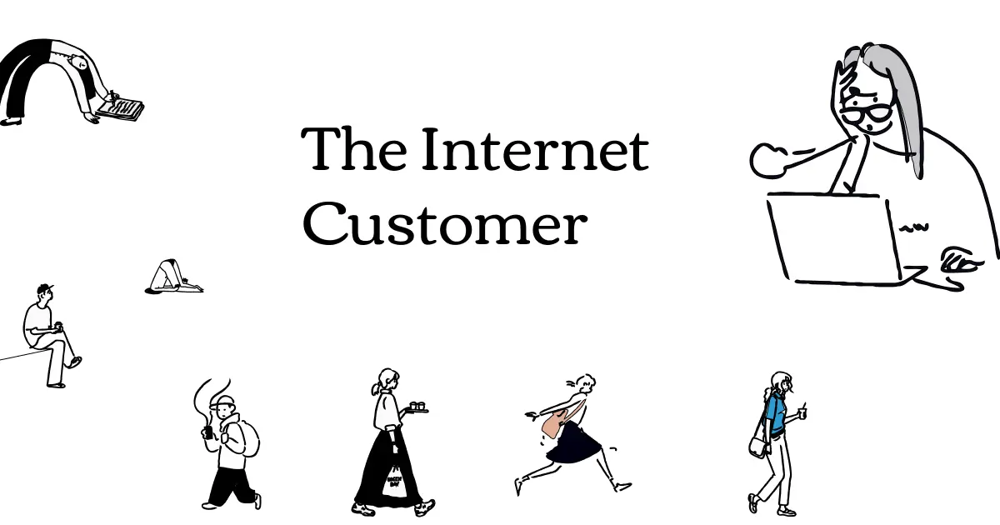
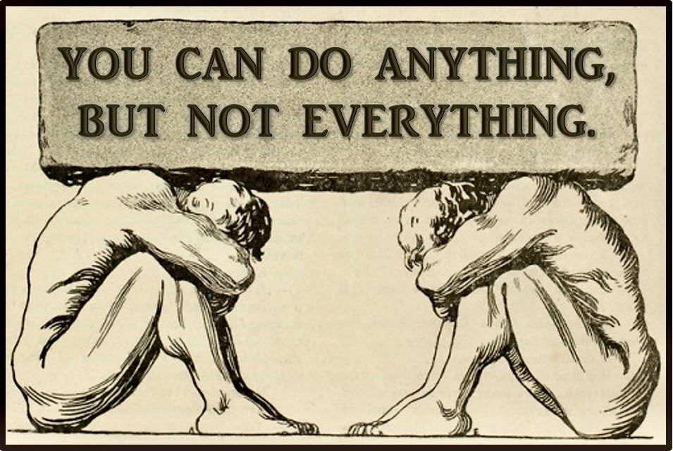

Started my journey with helping people without any judgement especially my close friends who are non techy and ofcourse
it also comes down to how my parents are a bit fluent with internet but whenever they need some help i tend to not judge
them and say "it's so easy or just search it up on google". We are supposed to be accepting of the fact that not everyone
knows how to use the internet.

Even my neighbors treat me as if i'm the best techie person in this world so whenever they are stuck with something they
give me a call. 

Whenever you're supposed to help somebody out you're not supposed to demean someone or make them look like a dumbo

Act like a gentle mother when you're catering a customer and helping them out you're supposed to make them feel accepted
so that they feel like a part of this product and they matter which they do unless until they are toxic themselves, you
need to handle them nicely though.

Passive Aggression is the worst possible thing to do even if the person is being rude.

And If we are talking about the B2B Space

I have served customers and helped onboard atleast 100-150 customers even as an intern dev rel guy at [Zerops](https://zerops.io/)
in a span of 12 months and most of them were technical but again even if i left it. It's still the best product for me but it's ui
confuses a lot of americans and asian people.

Most of the time videos do help you to get more conversions but not everyone watches a video if it's long maybe make short ones which
is concise and posting long videos on twitter is not the best way to showcase but youtube can be the right one.

Some [Tweet Examples](https://archived.arjunaditya.xyz/posts/viral-tweets) and for good videos i think you should watch [leerob](https://www.youtube.com/@leerob) or [delba](https://www.youtube.com/@Delba).

At the same time Vercel's user interface is very straightforward and this platform has onboarded so many non technical people that
it's so easy to use. Vercel Templates is a very good place for newbie devs to find stuff and just deploy it so majority of vercel
users are pretty young compared to vps or other PaaS.

A lot of my non techie people have their websites on vercel because the amount of tutorials and demos that platform has is the best
possible reason to get more people on-board.

People love that platform so much that they wanted to deploy their backends and discord bots as well but vercel doesn't facilitate
those features.

One of the best features provided by Next.js is 100s of Templates in almost everything not just nextjs but other frameworks with
very really nice underrated integrations.

Also just my speculation but netlify failed because of two reasons which were bad design + not enough content out there for it. Most
of the time it's just them sponsoring companies which doesn't really help imo.

If you want to grow a product and reach people you need to create as many as short screen recordings(this is good for basic stuff),
demos with audios(complexity) and docs are the last resort as they basically serve as the context for large language models.

Lot of people stopped reading documentations as of now all they do is just paste the link to [context7](https://context7.com).

LLMs are not the solution to every single customer query though but if we consider tech startups then llms can help 90% users if they
have a nice documentation + context to the agent + a nice chatbot with long term and short term memory.

For that I'm looking into Building Coldran to serve people.

-----

### How does an Internet Customer Surfs?

ps: this is mainly for tech b2b companies because that's what i know the best

- Customer goes to the website, they check if it's polished and concise (they don't care about your futuristic ui pls).
- Customer scrolls below and checks if this company has a discord community and social media.
- They watch the videos if there are any on the homepage.
- They go on youtube or reddit to check about this platform.
- They ask their friends if they have any.
- They register, do they find the dashboard nice or not? if they don't then they never pay.
- If they like the dashboard, they'll never leave even if they encounter an error after a week of using it.

- Design Shows Care & Value even though the product provides very little value.

Old people don't care about community but they do care about if they have a good social media presence + videos.

Old people also love to email a lot because they wanna be seen or maybe just slack, New Generation refrains to mail because they find it long instead they use discord.

Some attention wh*res also love tagging on twitter but it's not so bad, just being honest it'll just help the product get more reach even if the tweet has bad negative
connotation.

**How do you mentally soothe them?**
- Beautiful Minimal Design with important concise details only(best example is [basecamp](https://basecamp.com/)).
- Illusion of control, certainty, and familiarity
- Be Playful & Funny (Memes Help you grow)

Let's suppose the Customer says:

- **Id**: I want resolution now.
- **Ego**: I'll wait if I feel heard.
- **Superego**: I want to be a “good” customer.

**The ego**: “Thanks for your patience, we're working on it.”

**The superego**: “Your feedback helps us improve the system for others.”

**The Zeigarnik Effect**

A ticket left unresolved creates cognitive tension.
- If you just say “We'll get back to you,” that tension spikes.
- If you say: “We'll reply by 3 PM Friday” it closes the loop mentally.

**The Parasocial Relationship** *(avg influencer fanboy)*

People bond with faces, names, and tone even in digital interactions.
- Add a name to your bot (e.g., “Helloo! I'm Arjun I'd love to know what you're facing).
- Add a face and a nice bio *(human touch)*.
- Add a story (“I'll stay with you till this is solved and let me know if you want to hop on a call”).

ps: you're calming their evolved human brain with personhood, not just protocol.

Give some freebies if your resolution takes a lot of time. You're responsible for them not them.

ALSO DON'T BE DRY PLEASE, NOT EVERYONE IS DEAD EUROPEAN WHO CAN'T EVEN SAY "Helloo" pls don't use "Hi".

**So how do you serve the customers want?** *(treat them as humans bro)*

If you have a bug then well fix it and if it's related to other stuff about how a person can understand the product usage.

- **First Resort**: Demo Videos over Textual Data(the attention span is dropping crazy)
- **Second Resort**: Customer AI Agent
- **Third Resort**: Human Attention via Text
- **Fourth Resort**: Video Calls with Screen Recording which matches their time zone.

------

### How Design Changes the Behavior

Whenever you're building a product you have to consider that every person has face different problems everyday maybe from color blindness, attention
span and language barrier(eg. english as second lang).

You should deep research about your target audience and then create a unified product design with concise information not just because you like it.

Users see everything differently so you do need feedback if they understand the whole product in 3-4s.

My Best Favorite Products which are concise: [Basecamp](https://basecamp.com), [Notion](https://www.notion.com), [Chatbase](https://www.chatbase.co), [Ghost](https://ghost.org), [Mintlify](https://mintlify.com), [Realm](https://www.withrealm.com) and [Incident](https://incident.io)

Also watch videos by [Phoebe Yu](https://phoebeyu.co) about How Design Changes.

<iframe width="400" height="200" src="https://www.youtube.com/embed/qdHipyZgOTY?si=79FlwP6hrp8xWCon" title="YouTube video player" frameborder="0" allow="accelerometer; autoplay; clipboard-write; encrypted-media; gyroscope; picture-in-picture; web-share" referrerpolicy="strict-origin-when-cross-origin" allowfullscreen></iframe>
<iframe width="400" height="200" src="https://www.youtube.com/embed/qdHipyZgOTY?si=iAZFw5_3sq_aIIdY" title="YouTube video player" frameborder="0" allow="accelerometer; autoplay; clipboard-write; encrypted-media; gyroscope; picture-in-picture; web-share" referrerpolicy="strict-origin-when-cross-origin" allowfullscreen></iframe>

<iframe width="400" height="200" src="https://www.youtube.com/embed/6XzGh_5hikU?si=LxJn5x7PO_y179On" title="YouTube video player" frameborder="0" allow="accelerometer; autoplay; clipboard-write; encrypted-media; gyroscope; picture-in-picture; web-share" referrerpolicy="strict-origin-when-cross-origin" allowfullscreen></iframe>
<iframe width="400" height="200" src="https://www.youtube.com/embed/AnxOnVY-dC8?si=GGHRoXxGBCvEQmMk" title="YouTube video player" frameborder="0" allow="accelerometer; autoplay; clipboard-write; encrypted-media; gyroscope; picture-in-picture; web-share" referrerpolicy="strict-origin-when-cross-origin" allowfullscreen></iframe>

Also [Laws of Ux](https://lawsofux.com) is a good read.

-------

### Current Support Issues

I've seen a lot of people don't reply to discord messages in channel, late email replies
we are supposed to have sales and customer relationship people more than just developers
even if you're a tech startup having just ai is not good enough for some issues but again.

Most of them ask people to use different channels to open ticket when ticket channel is supposed
to be the 

I'm working on Coldran to help companies interact better and faster while also understanding customer problems better.

Most of the companies suffer from problems like time zone issue and when a person with
a different time zone hops in they tend to fail at serving. Hire people from every continent please.

The Only Way Software can eat the world is by having the patience to educate others about how to utilize.

Without no Judgement. Be Their Friend Please(and if you can't you're going to
fail to serve 30-40% of your potential users.)

The Best Customer Service I've seen is by [Astro](https://astro.build), [Zerops](https://zerops.io), [Ghost](https://ghost.org) and [Polar](https://polar.sh).

The Zerops CEO and CTO whenever they are awake they reply in max 1-2 minutes or even seconds.

But yes people are suffering from time zone issues. The worst so far for me has been [Same.dev](https://same.dev), I'd love to improve it though I have some ideas.

Recently I scraped discord messages from same's discord server and asked chatgpt with deep research mode to help me find the top 50 complaints here's the [chat](https://chatgpt.com/share/688c3afb-d0e8-800d-a133-050cba74f311).

Being Concise helps a lot even in cold emails and landing page.

If I feel like adding any other idea, I'll just add here.

This Blog is raw and not passed through a large language model.